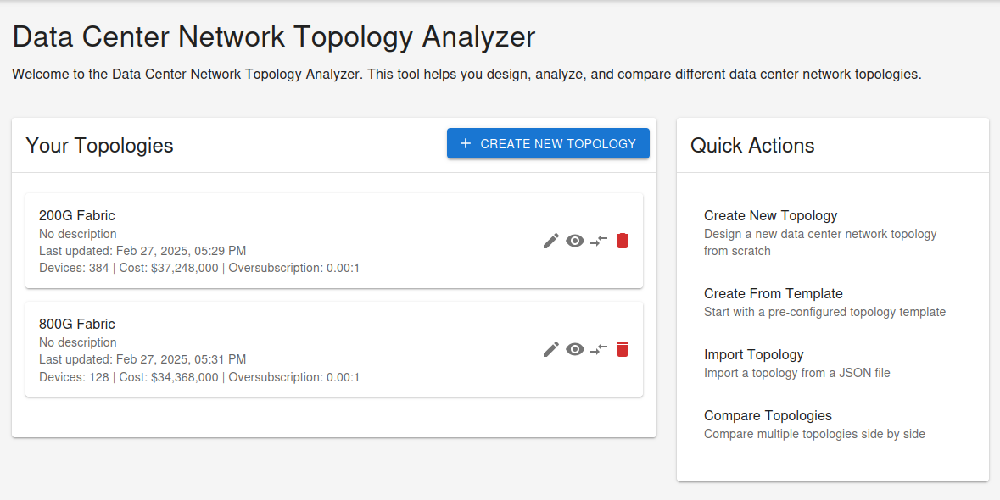
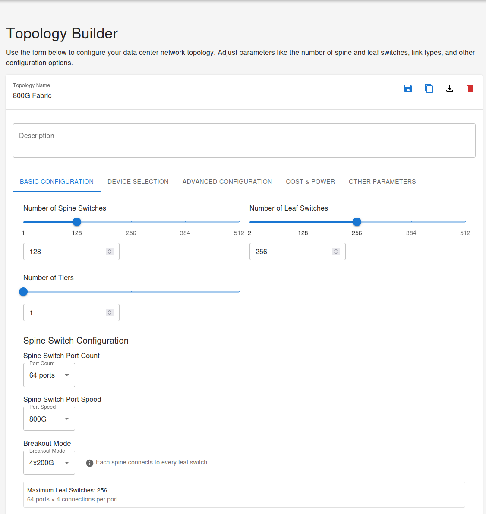
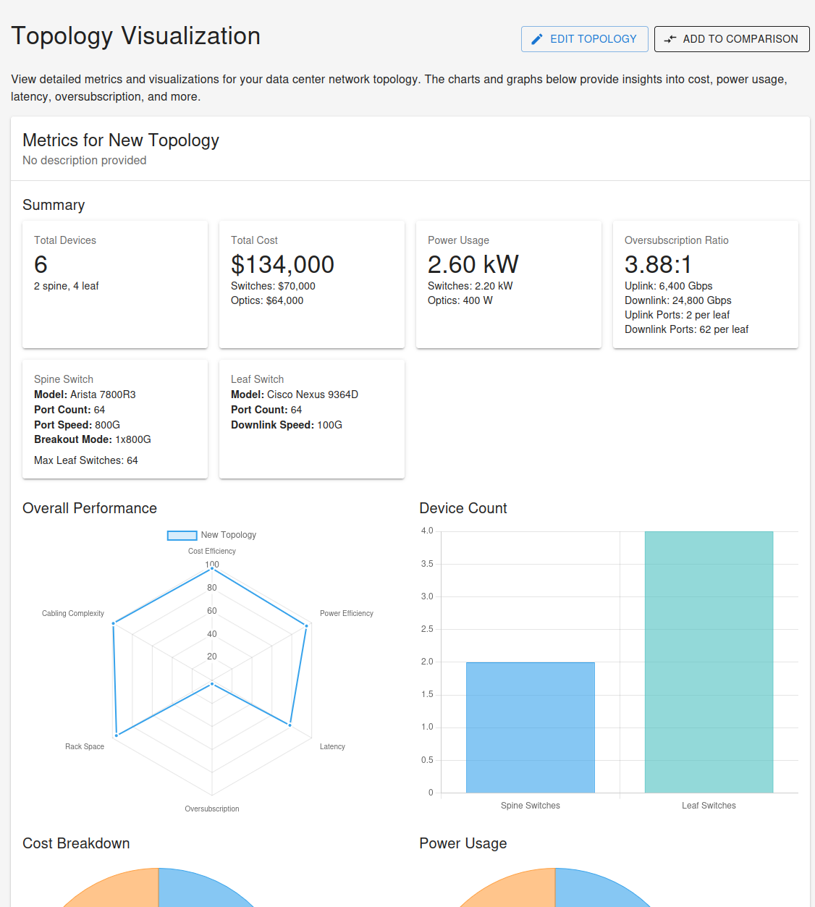
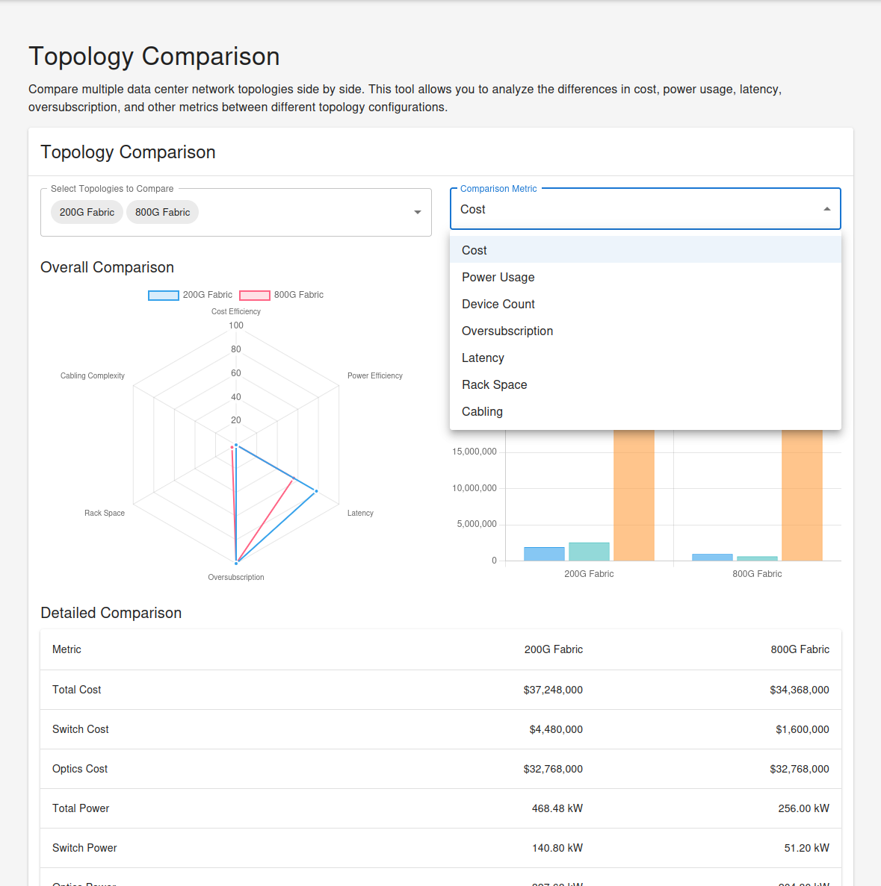

# Data Center Network Topology Analyzer

A powerful web application for designing, analyzing, and comparing different data center network topologies with a focus on Clos architectures.

## Features

- **Design Clos Network Topologies**: Create and customize data center network topologies with various parameters
- **Pre-configured Templates**: Start with common topology templates like leaf-spine, 3-tier Clos, and more
- **Advanced Configuration Options**: Configure spine and leaf switches, port counts, link speeds, and breakout modes
- **Comprehensive Analysis**: Calculate and visualize key metrics including:
  - Cost breakdown
  - Power usage
  - Latency
  - Oversubscription ratios
  - Rack space requirements
  - Cabling considerations
- **Side-by-Side Comparison**: Compare multiple topologies to find the optimal design
- **Import/Export**: Share topology designs with JSON export/import functionality
- **Dark Mode**: Toggle between light and dark themes for comfortable viewing

## Screenshots

### Home Page

*The application home page provides quick access to create new topologies, use templates, or import existing designs.*

### Topology Builder

*The topology builder interface allows detailed configuration of spine and leaf switches, including manufacturer selection, port configurations, and advanced settings.*

### Topology Visualization

*The visualization page displays comprehensive metrics and analytics for the selected topology, including cost breakdown, power usage, and network characteristics.*

### Topology Comparison

*The comparison view enables side-by-side analysis of multiple topologies to identify the optimal design for specific requirements.*

## Getting Started

### Prerequisites

- Node.js 14.x or higher
- npm 6.x or higher

### Installation

1. Clone the repository
   ```bash
   git clone https://github.com/yourusername/dc-network-topology-analyzer.git
   cd dc-network-topology-analyzer
   ```

2. Install dependencies
   ```bash
   npm install
   ```

3. Start the development server
   ```bash
   npm start
   ```

4. Open [http://localhost:3000](http://localhost:3000) to view the application

## Usage

### Creating a New Topology

1. Click "Create New Topology" on the home page
2. Configure the basic parameters (spine switches, leaf switches, tiers)
3. Adjust advanced settings like port speeds and breakout modes
4. Save your topology

### Using Templates

1. Click "Create From Template" on the home page
2. Select a pre-configured template (Small Leaf-Spine, 3-Tier Clos, etc.)
3. Customize the template as needed
4. Save your topology

### Comparing Topologies

1. Add topologies to the comparison queue using the compare icon
2. Navigate to the Comparison page
3. View side-by-side metrics and charts

### Importing/Exporting

- Export: Click the export icon on any topology to download as JSON
- Import: Click "Import Topology" and select a previously exported JSON file

## Deployment

### Production Build

Create a production-ready build:

```bash
npm run build
```

The build folder can be deployed to any static hosting service.

### Vercel Deployment

This application is optimized for deployment on Vercel:

1. Prepare for deployment:
   ```bash
   # Install Vercel CLI (if you haven't already)
   npm install -g vercel
   ```

2. Deploy to Vercel:
   ```bash
   npm run deploy:vercel
   ```

For detailed instructions, configuration options, and troubleshooting, refer to the [README-vercel.md](./README-vercel.md) file.

**Note:** This project uses TypeScript 4.9.5 for compatibility with React Scripts 5.0.1. The Vercel configuration includes specific routing settings and optimizations for the best performance.

### Docker Deployment

To containerize the application with Docker:

1. Create a Dockerfile in the project root:

```dockerfile
# Build stage
FROM node:16 as build
WORKDIR /app
COPY package*.json ./
RUN npm install
COPY . .
RUN npm run build

# Production stage
FROM nginx:alpine
COPY --from=build /app/build /usr/share/nginx/html
EXPOSE 80
CMD ["nginx", "-g", "daemon off;"]
```

2. Build the Docker image:
   ```bash
   docker build -t dc-network-topology-analyzer .
   ```

3. Run the container:
   ```bash
   docker run -p 8080:80 dc-network-topology-analyzer
   ```

4. Access the application at [http://localhost:8080](http://localhost:8080)

### Electron Desktop App

To create a desktop application:

1. Add Electron dependencies:
   ```bash
   npm install --save-dev electron electron-builder concurrently wait-on
   ```

2. Update package.json with Electron configuration
3. Create main Electron file
4. Build for different platforms:
   ```bash
   npm run electron-build
   ```

## Technology Stack

- React.js
- Material-UI
- Chart.js
- LocalForage (for client-side storage)

## Project Structure

```
dc-network-topology-analyzer/
├── public/                  # Static files
├── src/                     # Source code
│   ├── components/          # React components
│   │   ├── Comparison/      # Topology comparison components
│   │   ├── Layout/          # Layout components
│   │   ├── TopologyBuilder/  # Topology builder components
│   │   └── Visualization/   # Visualization components
│   ├── context/             # React context providers
│   ├── pages/               # Page components
│   ├── services/            # Service modules
│   ├── utils/               # Utility functions
│   ├── App.js               # Main App component
│   └── index.js             # Entry point
└── package.json             # Project dependencies and scripts
```

## Contributing

Contributions are welcome! Please feel free to submit a Pull Request.

1. Fork the repository
2. Create your feature branch (`git checkout -b feature/amazing-feature`)
3. Commit your changes (`git commit -m 'Add some amazing feature'`)
4. Push to the branch (`git push origin feature/amazing-feature`)
5. Open a Pull Request

## License

This project is licensed under the MIT License - see the LICENSE file for details.

## Acknowledgments

- Inspired by the need for rapid data center network design and comparison
- Thanks to all contributors who have helped shape this tool

---

For more information or support, please open an issue on GitHub.
